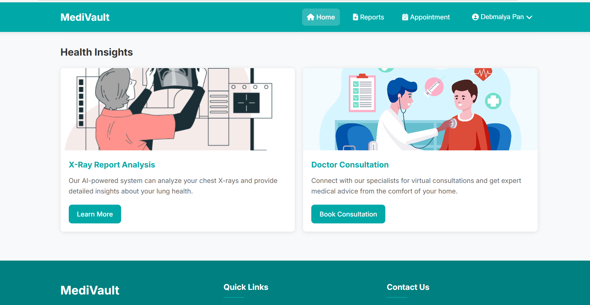

# MediVault

A comprehensive medical management platform designed to streamline healthcare processes for patients, doctors, and administrators. MediVault offers appointment booking, medical record management, AI-powered assistance, and more—all in a secure, user-friendly environment.

## 🌐 Live Demo
[Visit MediVault Online](https://medivault-0drq.onrender.com/)

---

## Features

- **User Authentication:** Secure login and registration for patients and admins.
- **Appointment Booking:** Book, view, and manage appointments with doctors by specialization and availability.
- **Doctor Directory:** Browse and filter doctors by specialty and availability.
- **Medical Reports:** Upload, view, and analyze medical reports.
- **AI Assistance:** Get instant medical insights and suggestions powered by AI.
- **Admin Dashboard:** Manage users, doctors, and appointments with advanced controls.
- **Responsive Frontend:** Modern, mobile-friendly UI for seamless experience.

---

## Project Structure

```
MediVault/
├── Backend/
│   ├── AI Assistance/         # AI-powered features (Python)
│   ├── AiMedical/             # Java Spring Boot backend
│   └── analysismedi/          # FastAPI microservices (Python)
├── Extension/                 # Browser extension for quick access
├── frontend/                  # HTML, CSS, JS frontend
│   ├── Admin/                 # Admin dashboard
│   └── User/                  # User dashboard and features
└── ...
```

---

## Getting Started

### Prerequisites
- HTML, CSS and JS(for frontend development)
- Python 3.10+ (for AI and analysis services)
- Java 21 & Maven (for Spring Boot backend)

### 1. Clone the Repository
```sh
git clone https://github.com/Debmalya06/MediVault.git
cd MediVault
```

### 2. Frontend
Open `frontend/index.html` in your browser for a static preview, or use a local server for development.

### 3. Backend (Spring Boot)
```sh
cd Backend/AiMedical
mvn spring-boot:run
```


### 4. Analysis Microservice (Python)
```sh
cd Backend/analysismedi
pip install -r requirements.txt
```

---

## Configuration
- **API URLs:** Update API endpoints in frontend JS files as needed for local or hosted deployment.
- **Environment Variables:** Store sensitive keys (e.g., AI API keys) in environment files, not in source code.

---

## Screenshots





---

## Contributing
Pull requests are welcome! For major changes, please open an issue first to discuss what you would like to change.

---

## License
[MIT](LICENSE)

---

## Author
- [Debmalya06](https://github.com/Debmalya06)

---

## Acknowledgements
- OpenAI, Spring Boot, and all open-source contributors.
